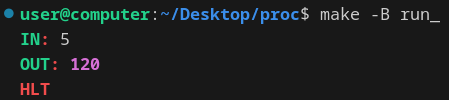

<div align="center">
  
  
  # 🛡️ Implementation of a simple virtual processor with emulated assembler in C (C++)
  
  
  
</div>

## 🚀 Quick Start:
To build the project:
```cpp
git clone https://github.com/BulgakovDmitry/proc
cd proc
make run
./asm.out
./proc.out
```

## 🔍 Overview:
This project is an emulator of a stack-based processor with its own instruction set. The project consists of two main components:
1. **Assembler (`asm`)**: Converts assembly code written in text format into binary code.
2. **Processor (`proc`)**: Executes the compiled binary code.

The project is implemented in C and includes:
- A stack for data storage and return addresses.
- General-purpose registers.
- Random-access memory (RAM).
- Support for labels to organize jumps and loops.

## ⚙️ Features
- **Instruction Set**: Supports arithmetic operations, input/output operations, conditional and unconditional jumps, subroutine calls, and returns.
- **Registers**: Provides 8 general-purpose registers (`ax`, `bx`, `cx`, `dx`, `ex`, `fx`, `gx`, `hx`).
- **Memory**: Includes RAM for data storage.
- **Labels**: Supports labels for organizing loops and conditional jumps.
- **Error Handling**: Detailed error messages with location information in case of issues.

## 📂 Project Structure:
```
proc/
├── asm/
│   ├── src/
|       ├── asm.cpp
|       ├── mainAsm.cpp
│   ├── headers/
|       ├── asm.hpp
|
├── proc/
│   ├── src/
|       ├── proc.cpp
|       ├── mainProc.cpp
│   ├── headers/
|       ├── asm.hpp
|
├── common/
│   ├── commonProcAsm.hpp
|
├── stack/...
├── assemblerFile.txt   
├── asm_code.bin        
├── myLib/...
```

## ✨ Processor Commands
- Arithmetic Operations: add, sub, mul, div, sqrt, sin, cos, tg, ctg.
- Input/Output: in, out.
- Flow Control: jmp, ja, jb, jae, jbe, je, jhe, call, ret, hlt.
- Stack Operations: push, pop.
- Debugging: dump, sdump.

## 💡 Example Assembly Code
This program counts the factorial of a positive integer:
Еnter, for example, the number 5
<div align="center">
  
</div>

Example content of `assemblerFile.txt`:
```asm
in

pop ax
push ax
pop bx
call fact
push bx

out
hlt

fact:
push ax
push 1
je end
push bx
push ax
call decrease
mul
pop bx
push ax
call decrease
pop ax
call fact

end:
ret

decrease:
push 1
sub
ret
```
